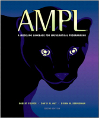

# AMPL & Optimization Books

This page offers a collection of resources for learning mathematical optimization with AMPL, including the original [AMPL Book](#ampl-a-modeling-language-for-mathematical-programming) and other works focused on practical applications like [Python integration](#mo-book-hands-on-mathematical-optimization-with-ampl-in-python), [electricity markets](#optimization-models-in-electricity-markets), and general optimization topics.

## AMPL: A Modeling Language for Mathematical Programming



**AMPL: A Modeling Language for Mathematical Programming**  
by Robert Fourer, David M. Gay, and Brian W. Kernighan
Second edition  
517 + xxi pp., ISBN 0-534-38809-4  
[The AMPL Book PDF](./ampl/ampl-book.pdf)

```{toctree}
:glob:
:maxdepth: 1
ampl/index.md
```

## MO-Book: Hands-On Mathematical Optimization with AMPL in Python

The repository of notebooks [Hands-On Mathematical Optimization with AMPL in Python](https://ampl.com/mo-book/) introduce the concepts and tools of mathematical optimization with examples from a range of disciplines. The goals of these notebooks are to:

-   provide a foundation for hands-on learning of mathematical optimization,
-   demonstrate the tools and concepts of optimization with practical examples,
-   help readers to develop the practical skills needed to build models and solving problems using state-of-the-art modeling languages and solvers.

```{toctree}
:glob:
:maxdepth: 1
mo-book.md
```

## Optimization Models by Fabio Schoen

[Optimization Models](https://webgol.dinfo.unifi.it/OptimizationModels/contents.html) by [Fabio Schoen](https://www.linkedin.com/in/fabioschoen/) is an e-book on modeling techniques for Operations Research. A new book on the art of modeling optimization problems. This text was used in the “Optimization and Data Science for Management” course, Master degree in Management Engineering at the University of Florence.

```{toctree}
:glob:
:maxdepth: 1
fabio-schoen.md
```

## Optimization Models in Electricity Markets


[Optimization Models in Electricity Markets](https://www.cambridge.org/highereducation/books/optimization-models-in-electricity-markets/0D2D36891FB5EB6AAC3A4EFC78A8F1D3?utm_campaign=shareaholic&utm_medium=copy_link&utm_source=bookmark) by [Anthony Papavasiliou](https://www.linkedin.com/in/anthony-papavasiliou-4bab9213/) is a textbook published by Cambridge University Press that treats the analysis of optimization models that are routinely used in electricity market operations.

```{toctree}
:glob:
:maxdepth: 1
anthony-papavasiliou/electricity-markets.md
```

## Book on General Optimization Topics

-   H.T. Lau, _[A Numerical Library in C for Scientists and Engineers](https://www.amazon.com/exec/obidos/ISBN=084937376X/amplA/)._ CRC Press, 1995. _Includes a section on optimization; comes with a disk._
    
-   G.L. Nemhauser, A.H.G. Rinnooy Kan and M.J. Todd (editors), _[Optimization](https://www.amazon.com/exec/obidos/ISBN=0444872841/amplA/)._ Handbooks in Operations Research and Management Science, volume 1. North-Holland, 1989. _A broad reference with large biliography. Entries are at a fairly advanced level._
    
-   Hamdy A. Taha, _[Operations Research: An Introduction](https://www.amazon.com/exec/obidos/ISBN=0131889230/amplA/),_ 8th edition. Prentice Hall, 2006. _Makes extensive use of AMPL in examples and exercises._
    
-   H.P. Williams, _[Model Building in Mathematical Programming](https://www.amazon.com/exec/obidos/ISBN=0471997889/amplA/),_ 4th edition. Wiley, 1993. _A popular collection of optimization models and modeling techniques._
    
-   W.L. Winston, _[Introduction to Mathematical Programming: Applications and Algorithms](https://www.amazon.com/exec/obidos/ISBN=0534230474/amplA/),_ 2nd edition. Wadsworth, 1997. _A widely used elementary introduction to optimization topics._

## Linear Programming Books

-   D. Bertsimas and J. Tsitsiklis, _[Introduction to Linear Optimization](https://www.amazon.com/exec/obidos/ISBN=1886529191/amplA/)._ Athena Scientific, 1996.
    
-   V. Chvatal, _[Linear Programming](https://www.amazon.com/exec/obidos/ISBN=0716715872/amplA/)._ W.H. Freeman & Co., 1983. _A perennial favorite among introductory texts._
    
-   S.I. Gass, _[An Illustrated Guide to Linear Programming](https://www.amazon.com/exec/obidos/ISBN=0486262588/amplA/)._ Dover, 1990. _An inexpensive reprint of a classic introduction._
    
-   I. Maros, _[Computational Techniques of the Simplex Method](https://www.amazon.com/exec/obidos/ISBN=1402073321/amplA/)._ Kluwer, 2003.
    
-   R. Saigal, _[Linear Programming: A Modern Integrated Analysis](https://www.amazon.com/exec/obidos/ISBN=0792396227/amplA/)._ Kluwer, 1995.
    
-   R.J. Vanderbei, _[Linear Programming: Foundations and Extensions](https://www.amazon.com/exec/obidos/ISBN=0792373421/amplA/),_ 2nd edition. Kluwer, 2001. _An introductory graduate-level text covering theory and computation for both simplex and interior-point methods._
    
-   S.J. Wright, _[Primal-Dual Interior-Point Methods](https://www.amazon.com/exec/obidos/ISBN=089871382X/amplA/)._ SIAM, 1997.
    

## Nonlinear Programming Books

-   M.S. Bazaraa, H.D. Sherali and C.M. Shetty, _[Nonlinear Programming: Theory and Algorithms](https://www.amazon.com/exec/obidos/ISBN=0471557935/amplA/)._ Wiley, 1992.
    
-   D.P. Bertsekas, _[Nonlinear Programming](https://www.amazon.com/exec/obidos/ISBN=1886529140/amplA/)._ Athena Scientific, 1995.
    
-   R. Fletcher, _[Practical Methods of Optimization](https://www.amazon.com/exec/obidos/ISBN=0471494631/amplA/), 2nd edition._ Wiley, 2000.
    
-   P.E. Gill, W. Murrary and M.H. Wright, _[Practical Optimization](https://www.amazon.com/exec/obidos/ISBN=0122839528/amplA/)._ Academic Press, 1981.
    
-   D.G. Luenberger, _[Linear and Nonlinear Programming](https://www.amazon.com/exec/obidos/ISBN=0201157942/amplA/), 2nd edition._ Addison-Wesley, 1984.
    
-   S. Nash and A. Sofer, _[Linear and Nonlinear Programming](https://www.amazon.com/exec/obidos/ISBN=0070460655/amplA/)._ McGraw-Hill, 1996.
    
-   J. Nocedal and S.J. Wright, _[Numerical Optimization](https://www.amazon.com/exec/obidos/ISBN=0387987932/amplA/)._ Springer Verlag, 1999.

## Integer Programming and Combinatorial Optimization Books

-   W.J. Cook, W.H. Cunningham, W.R. Pulleyblank and A. Schrijver, _[Combinatorial Optimization](https://www.amazon.com/exec/obidos/ISBN=047155894X/amplA/)._ Wiley Interscience, 1997. _A comprehensive and up-to-date treatment._
    
-   G.L. Nemhauser and L.A. Wolsey, _[Integer and Combinatorial Optimization](https://www.amazon.com/exec/obidos/ISBN=0471359432/amplA/)._ Wiley Interscience, 1988. _An advanced text that covers many theortical and computational topics in integer programming._
    
-   C.H. Papadimitriou and K. Steiglitz, _[Combinatorial Optimization: Algorithms and Complexity](https://www.amazon.com/exec/obidos/ISBN=0486402584/amplA/)._ Dover, 1998. _Recently reprinted in an inexpensive paperback edition._
    
-   L.A. Wolsey, _[Integer Programming](https://www.amazon.com/exec/obidos/ISBN=0471283665/amplA/)._ Wiley, 1998. _An introduction to the subject and its applications._

## Network Optimization Books

-   R.K. Ahuja, T.L. Magnanti and J.B. Orlin, _[Network Flows: Theory, Algorithms, and Applications](https://www.amazon.com/exec/obidos/ISBN=013617549X/amplA/)._ Prentice-Hall, 1993. _A comprehensive recent survey of the topic._
    
-   D.P. Bertsekas, _[Linear Network Optimization: Algorithms and Codes](https://www.amazon.com/exec/obidos/ISBN=0262023342/amplA/)._ MIT Press, 1991. _Includes code for a variety of network algorithms._
    
-   D.P. Bertsekas, _[Network Optimization: Continuous and Discrete Models](https://www.amazon.com/exec/obidos/ISBN=1886529027/amplA/)._ Athena Scientific, 1998.
    
-   K.G. Murty, _[Network Programming](https://www.amazon.com/exec/obidos/ISBN=013615493X/amplA/)._ Prentice-Hall, 1992.

## Additional Topics

-   D.P. Bertsekas and J. Tsitsiklis, _[Parallel and Distributed Computation: Numerical Methods](https://www.amazon.com/exec/obidos/ISBN=1886529019/amplA/)._ Athena Scientific, 1997.
    
-   Y. Censor and S.A. Zenios, _[Parallel Optimization: Theory, Algorithms, and Applications](https://www.amazon.com/exec/obidos/ISBN=019510062X/amplA/)._ Oxford University Press, 1998. _Winner of the 1999 INFORMS Computing Society Prize for Research Excellence in the Interface Between Operations Research and Computer Science._
    
-   L.S. Lasdon, _[Optimization Theory for Large Systems](https://www.amazon.com/exec/obidos/ISBN=0486419991/amplA/)._ Dover, 2002. _A survey of decomposition, relaxation, column-generation, and compact-basis methods for large-scale optimization, in an inexpensive reprint edition._
    
-   K. Marriott and P.J. Stuckey, _[Programming With Constraints: An Introduction](https://www.amazon.com/exec/obidos/ISBN=0262133415/amplA/)._ MIT Press, 1998. _An introduction to techniques that can provide an alternative to integer programming for highly combinatorial problems._ (See also the [AMPL extensions](https://ampl.com/products/ampl/logic-and-constraint-programming-extensions/) that take advantage of constraint logic programming solvers.)
    
-   J.D. Pinter, _[Global Optimization in Action: Continuous and Lipschitz Optimization: Algorithms, Implementations and Applications](https://www.amazon.com/exec/obidos/ISBN=0792337573/amplA/)._ Kluwer, 1996. _Winner of the 1999 INFORMS Computing Society Prize for Research Excellence in the Interface Between Operations Research and Computer Science._
